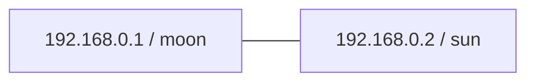

# defectio

The word “defectio” signifies an “eclipse” or a “failing”. Name inspried from the quickstart machine names.

## Host to Host

[Host to Host Quickstart config](https://docs.strongswan.org/docs/5.9/config/quickstart.html#_host_to_host_case)

